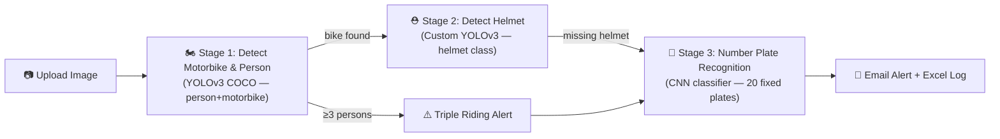
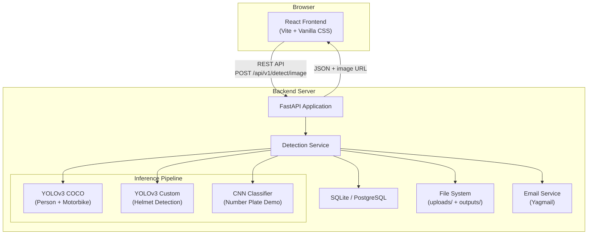
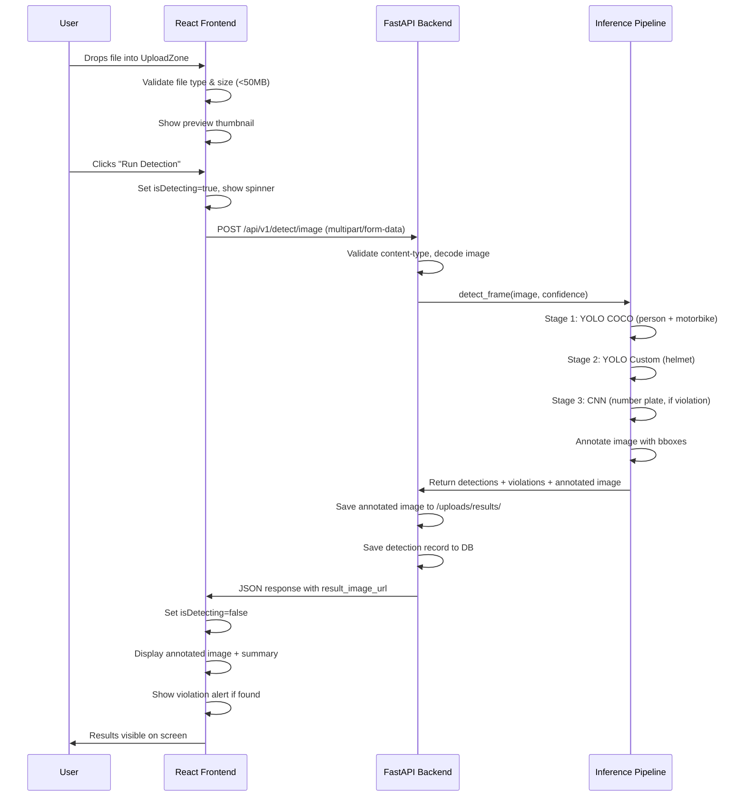
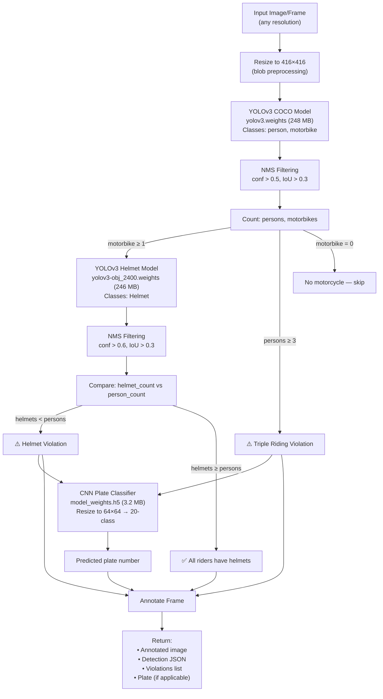
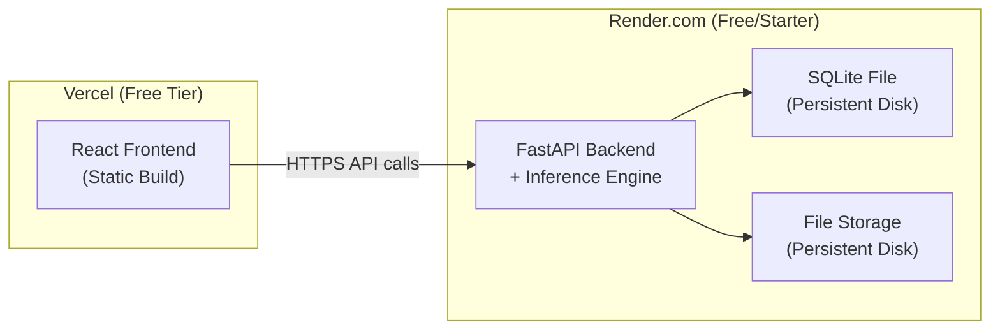

# 🏍️ Helmet Detection System — Full-Stack Web Application Design

> **Complete System Design & Migration Plan**
> Authored from a deep analysis of the existing project at `C:/Users/karth/Desktop/major project/HelmetDetection_project`

---

## Table of Contents

1. [Current Project Analysis](#1-current-project-analysis)
2. [Problems in the Current Structure](#2-problems-in-the-current-structure)
3. [Recommended Target Architecture](#3-recommended-target-architecture)
4. [Frontend Design](#4-frontend-design)
5. [Backend Design](#5-backend-design)
6. [Inference Pipeline Design](#6-inference-pipeline-design)
7. [Final Folder Structure](#7-final-folder-structure)
8. [API Design](#8-api-design)
9. [Deployment Design](#9-deployment-design)
10. [Security & Scaling](#10-security--scaling)
11. [Migration Roadmap](#11-migration-roadmap)
12. [Final Recommendations](#12-final-recommendations)

---

## 1. Current Project Analysis

### 1.1 Project Variants Discovered

Your `major project` folder contains **three distinct versions** of this project:

| Variant | Path | Status |
|---|---|---|
| **Primary (Active)** | `HelmetDetection_project/` | Tkinter desktop app — working, Git-tracked |
| **Archive Variant** | `HelmetDetection_project1/` | Older copy with unrelated `.pka` files mixed in |
| **Web Attempt (TEST)** | `TEST/` | FastAPI + React + YOLOv8 scaffold — **partially built, never completed** |

> [!IMPORTANT]
> The `TEST/` folder contains a substantial prior attempt at exactly what you're asking for. It has ~90% of the architecture scaffolded (FastAPI backend, React frontend, YOLOv8 inference engine, SQLite DB, violation engine) but uses **YOLOv8/Ultralytics** which is a different model ecosystem than your trained YOLOv3 weights. This is a critical compatibility decision.

### 1.2 Primary Project File Inventory

```
HelmetDetection_project/
├── HelmetDetection.py          # Main app — Tkinter GUI (340 lines)
├── yoloDetection.py            # YOLO detection + NMS + drawing (91 lines)
├── yolo.py                     # CLI detection for image/video (82 lines)
├── Models/
│   ├── yolov3-obj.cfg          # Custom YOLOv3 config for HELMET detection
│   ├── yolov3-obj_2400.weights # Trained helmet weights (246 MB) ⭐
│   ├── model.json              # CNN number-plate model architecture (Keras Sequential)
│   ├── model_weights.h5        # CNN number-plate weights (3.2 MB)
│   ├── labels.txt              # 20 hardcoded number plates (classification labels)
│   ├── obj.names               # Single class: "Helmet"
│   ├── scooter.data            # Darknet training config (paths broken)
│   ├── scooter.names           # Single class: "scooter-driver"
│   └── yolov3-scooter.cfg      # Unused scooter model config
├── yolov3model/
│   ├── yolov3.cfg              # Standard COCO YOLOv3 config
│   ├── yolov3.weights          # COCO pre-trained weights (248 MB) ⭐
│   ├── yolov3-labels           # 2 classes: "person", "motorbike"
│   └── label_backup.txt        # Full 80-class COCO label list
├── bikes/                      # 29 test images (sample dataset)
├── detected_numberplates.xlsx  # Output violation log
├── requirements.txt            # 8 dependencies
├── .env                        # Email credentials (EXPOSED!)
├── run.bat                     # Windows launcher
├── test_cv2_gui.py             # OpenCV GUI test utility
├── test_load.py                # TF/Keras model load test
├── README.md                   # Project documentation
├── SCREENS.docx                # Screenshots (1.9 MB)
├── .gitattributes              # LFS tracking for .weights, .h5
└── .gitignore                  # Standard Python ignores
```

### 1.3 What the Current Project Does

The system implements a **3-stage sequential pipeline** via a Tkinter desktop GUI:



**Stage 1 — Motorbike & Person Detection**
- Uses `yolov3model/yolov3.weights` (standard COCO model)
- Filters to only classes 0 (person) and 1 (motorbike) via `yolov3-labels`
- Counts persons and bikes; if ≥3 persons → triple riding violation

**Stage 2 — Helmet Detection**
- Uses `Models/yolov3-obj_2400.weights` (custom trained, single class: Helmet)
- Runs only if Stage 1 found a motorbike
- If helmet count < person count → helmet violation

**Stage 3 — Number Plate Recognition**
- Uses `Models/model.json` + `model_weights.h5` (small CNN classifier)
- **Does NOT perform OCR** — it's a 20-class classifier mapping to 20 hardcoded plate numbers
- Input: entire image resized to 64×64 → outputs one of 20 predefined plates
- This is essentially a **demo/proof-of-concept**, not real ANPR

### 1.4 Model Details

| Model | Type | Framework | Input Size | Classes | File Size | Usable? |
|---|---|---|---|---|---|---|
| Motorbike/Person detector | YOLOv3 (Darknet) | OpenCV DNN | 416×416 | 2 (filtered from COCO-80) | 248 MB | ✅ Yes |
| Helmet detector | YOLOv3 (custom) | OpenCV DNN | 416×416 | 1 (Helmet) | 246 MB | ✅ Yes |
| Number plate classifier | CNN Sequential | TensorFlow/Keras | 64×64 | 20 (hardcoded plates) | 3.2 MB | ⚠️ Demo only |

### 1.5 Prior Web Attempt (TEST/) Analysis

The `TEST/` folder represents a **well-structured but incomplete** modernization attempt:

| Component | Status | Notes |
|---|---|---|
| FastAPI backend `main.py` | ✅ Scaffolded | CORS, routing, lifespan, static files |
| Detection API endpoints | ✅ Built | Image, video, camera, status endpoints |
| Detection service layer | ✅ Built | Lazy model loading, frame/video/camera processing |
| YOLOv8 detector | ✅ Built | Uses `ultralytics` — **NOT compatible with your YOLOv3 weights** |
| CNN helmet classifier | ✅ Built | PyTorch ResNet-based — different from your Keras CNN |
| Violation engine | ✅ Built | Rider-motorcycle association, triple-ride logic, violation scoring |
| Object tracker | ✅ Built | BoTSORT/ByteTrack tracking |
| Stream processor | ✅ Built | RTSP, webcam, video file processing |
| SQLite database | ✅ Built | Violations + DetectionLogs tables |
| CRUD operations | ✅ Built | Full CRUD for violations |
| React frontend | ✅ Built | Dashboard, stats, upload, violation log, charts |
| `config.yaml` | ✅ Built | Comprehensive config for all model params |
| **Model weights** | ❌ Missing | No trained YOLOv8 weights exist in `TEST/models/` |
| **Number plate service** | ❌ Missing | No ANPR integration |
| **Email alerts** | ❌ Missing | Notification service empty |
| **Tests** | ❌ Missing | No test files |
| **Docker** | ❌ Missing | Referenced in README but not created |

> [!TIP]
> The TEST attempt is architecturally sound but built around YOLOv8 (Ultralytics), which requires retraining or converting your existing YOLOv3 models. The recommended path is to **use the TEST architecture as a reference** but build the new system to work with your **existing YOLOv3 Darknet weights via OpenCV DNN**, which requires zero retraining.

---

## 2. Problems in the Current Structure

### 2.1 Critical Issues

| # | Issue | Severity | Impact |
|---|---|---|---|
| 1 | **Credentials exposed in `.env`** — App password for Gmail visible in repo | 🔴 Critical | Security breach risk |
| 2 | **No web interface** — Desktop-only Tkinter, unusable in browser | 🔴 Critical | Blocks deployment goal |
| 3 | **Number plate "recognition" is fake** — CNN classifies into 20 fixed plates, not real OCR | 🔴 Critical | Misleading functionality |
| 4 | **~500 MB model weights in repo** — Even with LFS, this makes cloning painful | 🟡 High | Developer experience |
| 5 | **Sequential blocking pipeline** — GUI freezes during inference | 🟡 High | UX problem |
| 6 | **No video processing in GUI** — `yolo.py` supports video but the Tkinter app only handles images | 🟡 High | Feature gap |
| 7 | **Global state everywhere** — All model references are global variables | 🟡 High | Untestable, crash-prone |
| 8 | **`cv.imshow()` for display** — Opens native OS windows, incompatible with web | 🟡 High | Blocks web migration |
| 9 | **No error boundaries** — Corrupted image or missing model crashes app | 🟠 Medium | Reliability |
| 10 | **Duplicated model loading** — Three separate model loaders with similar code | 🟠 Medium | Maintenance burden |
| 11 | **Hardcoded paths** — `'Models/model.json'`, `'yolov3model/yolov3.cfg'` etc. | 🟠 Medium | Deployment brittleness |
| 12 | **No logging** — Uses `print()` for everything | 🟠 Medium | No production observability |
| 13 | **Unused files** — `scooter.data`, `scooter.names`, `yolov3-scooter.cfg`, `gitignore.txt` | 🟢 Low | Clutter |

### 2.2 Architectural Debt Summary

```
Current State:                    Target State:
─────────────                    ─────────────
Tkinter Desktop App        →    React Web Application
Blocking GUI thread         →    Async API + WebSocket
Global state variables      →    Service classes with DI
cv.imshow() display         →    Browser-rendered results
print() debugging           →    Structured logging
Excel file logging          →    SQLite/PostgreSQL database
Hardcoded paths             →    Config-driven paths
No API layer                →    RESTful API + OpenAPI docs
Manual file selection       →    Drag-drop web upload
Email-only alerts           →    In-app + email notifications
```

---

## 3. Recommended Target Architecture

### 3.1 Technology Stack Decision Matrix

| Layer | Choice | Justification |
|---|---|---|
| **Frontend** | React 18 + Vite | Fast build, modern DX, component reuse. Vite over CRA for speed. |
| **UI Styling** | Vanilla CSS with CSS Custom Properties | Maximum control, no framework bloat. Dark-mode system. |
| **State Mgmt** | React Context + `useState`/`useReducer` | Project complexity doesn't warrant Redux/Zustand. |
| **Backend** | FastAPI (Python 3.10+) | Async-native, auto OpenAPI docs, excellent Python ML interop. |
| **Inference** | OpenCV DNN (your existing YOLOv3 weights) | **Zero retraining required.** Direct Darknet weight loading. |
| **Number Plate** | Keep existing CNN demo + flag for future EasyOCR upgrade | Honest about limitations, provides upgrade path. |
| **Database** | SQLite (dev) → PostgreSQL (prod) | SQLite for simplicity, PG when scaling. SQLAlchemy abstracts both. |
| **File Storage** | Local filesystem with UUID naming | Simple, works for single-server. S3 upgrade path documented. |
| **Email** | Yagmail (existing) via background task | Already working, move to async worker. |
| **Task Queue** | `asyncio` background tasks (FastAPI built-in) | Sufficient for single-server. Celery upgrade path noted. |
| **Logging** | Loguru | Structured, color-coded, file rotation. Already used in TEST/. |
| **Deployment** | Render.com (backend) + Vercel (frontend) | Free tier available, easy CI/CD, GPU available on Render if needed. |

### 3.2 High-Level Architecture



### 3.3 Critical Architecture Decision: YOLOv3 vs YOLOv8

| Factor | Use Existing YOLOv3 (OpenCV DNN) | Retrain with YOLOv8 (Ultralytics) |
|---|---|---|
| **Time to deploy** | Days | Weeks (need labeled dataset + training) |
| **Model weights** | Already have trained 246MB helmet weights | Must train from scratch |
| **Inference speed** | ~200-500ms on CPU | ~50-200ms on CPU |
| **Code complexity** | Manual bbox/NMS handling | Cleaner Ultralytics API |
| **GPU support** | CPU only via OpenCV DNN | CUDA, MPS, TensorRT |
| **Production quality** | Adequate for demo/MVP | Production-grade |

> [!IMPORTANT]
> **Recommendation: Start with YOLOv3 (OpenCV DNN) for MVP.** This gets you to a working web app in days, not weeks. Add a YOLOv8 upgrade path as Phase 7 in the migration roadmap. Your existing 246MB custom-trained helmet weights are valuable — don't throw them away.

---

## 4. Frontend Design

### 4.1 Framework & Build

- **Framework**: React 18
- **Bundler**: Vite 5
- **Styling**: Vanilla CSS with CSS Custom Properties (dark-mode-first design system)
- **HTTP Client**: Axios
- **Icons**: Lucide React
- **Animations**: Framer Motion
- **Charts**: Recharts (for analytics dashboard)
- **File Upload**: react-dropzone

### 4.2 Page Structure

```
┌────────────────────────────────────────────────────────────────┐
│  📱 Application Shell (App.jsx)                                │
│  ┌──────────┐  ┌──────────────────────────────────────────────┐│
│  │          │  │                                              ││
│  │ Sidebar  │  │  Page Content Area                           ││
│  │ (Nav)    │  │  ┌────────────────────────────────────────┐  ││
│  │          │  │  │  Route-based page rendering            │  ││
│  │ • Home   │  │  │                                        │  ││
│  │ • Detect │  │  │  /         → DashboardPage             │  ││
│  │ • History│  │  │  /detect   → DetectionPage             │  ││
│  │ • About  │  │  │  /history  → HistoryPage               │  ││
│  │          │  │  │  /about    → AboutPage                  │  ││
│  │          │  │  │                                        │  ││
│  │          │  │  └────────────────────────────────────────┘  ││
│  └──────────┘  └──────────────────────────────────────────────┘│
└────────────────────────────────────────────────────────────────┘
```

### 4.3 Page Definitions

#### Page 1: Dashboard (`/`)
- **Purpose**: Landing page showing system overview
- **Content**:
  - Hero section with project title, brief description, animated background
  - Stat cards: total detections, violations found, images processed, avg inference time
  - Quick-action buttons: "Upload Image", "Upload Video"
  - Recent detections carousel (last 5 results with thumbnails)
  - Technology stack display

#### Page 2: Detection (`/detect`) — **Core Page**
- **Purpose**: Upload files and run detection
- **Layout**: Two-column — left: upload/controls, right: results
- **Content**:
  - Drag-and-drop upload zone (accepts `.jpg`, `.png`, `.mp4`, `.avi`)
  - File preview panel (image thumbnail or video first-frame)
  - Detection controls: confidence threshold slider, detection mode selector
  - "Run Detection" button with loading state
  - Results panel:
    - Annotated image with bounding boxes
    - Detection summary cards (motorbikes, persons, helmets)
    - Violation alert banner (if violations detected)
    - Number plate display (if available)
    - Download annotated image button
    - Detection JSON details (expandable)

#### Page 3: History (`/history`)
- **Purpose**: Browse past detection results
- **Content**:
  - Grid/list view toggle for past detections
  - Each card shows: thumbnail, timestamp, violation count, file type
  - Click to view full detection details
  - Filter by: date range, violation type, file type
  - Pagination

#### Page 4: About (`/about`)
- **Purpose**: Project info, tech stack, team
- **Content**:
  - Project description and motivation
  - Architecture diagram
  - Technology cards
  - Model information

### 4.4 Component Structure

```
src/
├── components/
│   ├── layout/
│   │   ├── Sidebar.jsx              # Navigation sidebar
│   │   ├── Header.jsx               # Top bar with notifications
│   │   └── PageWrapper.jsx          # Page container with transitions
│   │
│   ├── detection/
│   │   ├── UploadZone.jsx           # Drag-drop file upload
│   │   ├── FilePreview.jsx          # Image/video preview
│   │   ├── DetectionControls.jsx    # Confidence slider, mode selector
│   │   ├── ResultsPanel.jsx         # Detection results container
│   │   ├── AnnotatedImage.jsx       # Image with bbox overlay
│   │   ├── DetectionSummary.jsx     # Stats cards for detections
│   │   ├── ViolationAlert.jsx       # Alert banner for violations
│   │   └── NumberPlateDisplay.jsx   # Plate recognition display
│   │
│   ├── dashboard/
│   │   ├── StatCard.jsx             # Animated stat card
│   │   ├── RecentDetections.jsx     # Recent results carousel
│   │   └── QuickActions.jsx         # Quick upload buttons
│   │
│   ├── history/
│   │   ├── HistoryGrid.jsx          # Grid of past detections
│   │   ├── HistoryCard.jsx          # Single detection card
│   │   └── HistoryFilters.jsx       # Date/type filters
│   │
│   └── common/
│       ├── LoadingSpinner.jsx       # Animated loading indicator
│       ├── ErrorBoundary.jsx        # React error boundary
│       ├── Notification.jsx         # Toast notifications
│       └── Badge.jsx                # Severity/status badges
│
├── pages/
│   ├── DashboardPage.jsx
│   ├── DetectionPage.jsx
│   ├── HistoryPage.jsx
│   └── AboutPage.jsx
│
├── hooks/
│   ├── useDetection.js              # Detection API hook
│   ├── useHistory.js                # History data hook
│   └── useNotification.js           # Toast notification hook
│
├── services/
│   └── api.js                       # Axios instance + API functions
│
├── styles/
│   ├── index.css                    # Design system + global styles
│   ├── dashboard.css                # Dashboard-specific styles
│   ├── detection.css                # Detection page styles
│   └── history.css                  # History page styles
│
├── utils/
│   ├── constants.js                 # App constants
│   └── formatters.js                # Date, file size formatters
│
├── App.jsx                          # Root component + routing
└── main.jsx                         # Vite entry point
```

### 4.5 State Management

```javascript
// App-level state via React Context
const AppContext = {
  // Detection state
  currentFile: null,           // File object being processed
  detectionResult: null,       // API response from detection
  annotatedImageUrl: null,     // URL of annotated result image
  isDetecting: false,          // Loading state
  detectionError: null,        // Error message if failed
  
  // History state  
  detectionHistory: [],        // Array of past results
  historyLoading: false,
  
  // UI state
  notifications: [],           // Toast notifications queue
  sidebarCollapsed: false,
  
  // Settings
  confidenceThreshold: 0.5,    // Default detection confidence
}
```

### 4.6 API Integration

```javascript
// services/api.js
import axios from 'axios';

const API_BASE = import.meta.env.VITE_API_URL || 'http://localhost:8000';

const api = axios.create({
  baseURL: `${API_BASE}/api/v1`,
  timeout: 120000, // 2min for video processing
});

export const detectImage = (file, confidence = 0.5) => {
  const formData = new FormData();
  formData.append('file', file);
  return api.post(`/detect/image?confidence=${confidence}`, formData);
};

export const detectVideo = (file, confidence = 0.5, skipFrames = 2) => {
  const formData = new FormData();
  formData.append('file', file);
  return api.post(`/detect/video?confidence=${confidence}&skip_frames=${skipFrames}`, formData);
};

export const getHistory = (page = 1, perPage = 12) =>
  api.get(`/history?page=${page}&per_page=${perPage}`);

export const getStats = () => api.get('/stats');
export const healthCheck = () => api.get('/health');
```

### 4.7 Upload & Detection Flow



### 4.8 Error & Loading States

| State | UI Behavior |
|---|---|
| **Idle** | Upload zone with dashed border, "Drop your file here" prompt |
| **File Selected** | Preview thumbnail, file info badge, "Run Detection" button enabled |
| **Detecting** | Full-screen overlay with animated spinner, progress text, disable all inputs |
| **Success** | Annotated image panel, detection summary cards, download button |
| **Violation Found** | Red alert banner with violation type, plate number if available, severity badge |
| **Error - Invalid File** | Orange toast: "Please upload a valid image (JPG, PNG) or video (MP4, AVI)" |
| **Error - File Too Large** | Orange toast: "File exceeds 50MB limit" |
| **Error - Server Down** | Red toast: "Cannot connect to detection server. Is the backend running?" |
| **Error - Detection Failed** | Red toast with error message, retry button |

### 4.9 Environment Variables (Frontend)

```env
# frontend/.env
VITE_API_URL=http://localhost:8000
VITE_MAX_FILE_SIZE_MB=50
VITE_APP_TITLE=Helmet Detection System
```

---

## 5. Backend Design

### 5.1 Framework & Stack

- **Framework**: FastAPI 0.100+
- **ASGI Server**: Uvicorn
- **ORM**: SQLAlchemy 2.0 (async)
- **Database**: SQLite (dev), PostgreSQL (prod)
- **Validation**: Pydantic v2
- **Logging**: Loguru
- **Email**: Yagmail
- **CV**: OpenCV (cv2) with DNN module
- **ML**: TensorFlow/tf-keras (for CNN plate model)

### 5.2 Module Structure

```
backend/
├── __init__.py
├── main.py                      # FastAPI app, lifespan, middleware
├── config.py                    # Settings from env vars (Pydantic BaseSettings)
│
├── api/                         # API route handlers
│   ├── __init__.py
│   ├── detection.py             # POST /detect/image, /detect/video
│   ├── history.py               # GET /history, GET /history/{id}
│   └── health.py                # GET /health, GET /stats
│
├── services/                    # Business logic layer
│   ├── __init__.py
│   ├── detection_service.py     # Orchestrates the 3-stage inference pipeline
│   ├── history_service.py       # CRUD for detection history
│   └── notification_service.py  # Email alerts via Yagmail
│
├── inference/                   # ML inference modules
│   ├── __init__.py
│   ├── model_manager.py         # Lazy model loader + singleton management
│   ├── bike_person_detector.py  # YOLOv3 COCO → person + motorbike
│   ├── helmet_detector.py       # YOLOv3 custom → helmet
│   ├── plate_classifier.py      # CNN → number plate (demo mode)
│   └── pipeline.py              # End-to-end pipeline orchestration
│
├── database/                    # Database layer
│   ├── __init__.py
│   ├── database.py              # Engine, session factory
│   ├── models.py                # SQLAlchemy ORM models
│   └── crud.py                  # Data access functions
│
├── schemas/                     # Pydantic request/response models
│   ├── __init__.py
│   ├── detection.py             # DetectionRequest, DetectionResponse
│   └── history.py               # HistoryResponse, StatsResponse
│
├── middleware/                  # Cross-cutting concerns
│   ├── __init__.py
│   └── error_handler.py         # Global exception handler
│
└── utils/                       # Utilities
    ├── __init__.py
    ├── file_utils.py            # File validation, safe naming, cleanup
    └── image_utils.py           # Image encoding/decoding helpers
```

### 5.3 Configuration (`config.py`)

```python
from pydantic_settings import BaseSettings
from pathlib import Path

class Settings(BaseSettings):
    # App
    APP_HOST: str = "0.0.0.0"
    APP_PORT: int = 8000
    APP_DEBUG: bool = False
    
    # Models
    YOLO_COCO_CFG: str = "models/yolov3model/yolov3.cfg"
    YOLO_COCO_WEIGHTS: str = "models/yolov3model/yolov3.weights"
    YOLO_COCO_LABELS: str = "models/yolov3model/yolov3-labels"
    
    YOLO_HELMET_CFG: str = "models/helmet/yolov3-obj.cfg"
    YOLO_HELMET_WEIGHTS: str = "models/helmet/yolov3-obj_2400.weights"
    
    CNN_PLATE_JSON: str = "models/plate/model.json"
    CNN_PLATE_WEIGHTS: str = "models/plate/model_weights.h5"
    CNN_PLATE_LABELS: str = "models/plate/labels.txt"
    
    # Detection thresholds
    CONFIDENCE_THRESHOLD: float = 0.5
    NMS_THRESHOLD: float = 0.3
    INPUT_WIDTH: int = 416
    INPUT_HEIGHT: int = 416
    TRIPLE_RIDE_MIN_PERSONS: int = 3
    
    # Storage
    UPLOAD_DIR: str = "data/uploads"
    OUTPUT_DIR: str = "data/outputs"
    MAX_FILE_SIZE_MB: int = 50
    
    # Database
    DATABASE_URL: str = "sqlite:///./data/helmet_detection.db"
    
    # Email
    SENDER_EMAIL: str = ""
    SENDER_PASSWORD: str = ""
    RECEIVER_EMAIL: str = ""
    ENABLE_EMAIL_ALERTS: bool = False
    
    # CORS
    CORS_ORIGINS: list = ["http://localhost:5173", "http://localhost:3000"]
    
    class Config:
        env_file = ".env"

settings = Settings()
```

### 5.4 Main Application (`main.py`)

```python
from contextlib import asynccontextmanager
from fastapi import FastAPI
from fastapi.middleware.cors import CORSMiddleware
from fastapi.staticfiles import StaticFiles
from loguru import logger
from pathlib import Path

from backend.config import settings
from backend.api.detection import router as detection_router
from backend.api.history import router as history_router
from backend.api.health import router as health_router
from backend.database.database import init_db

@asynccontextmanager
async def lifespan(app: FastAPI):
    logger.info("🚀 Starting Helmet Detection API...")
    for d in [settings.UPLOAD_DIR, settings.OUTPUT_DIR]:
        Path(d).mkdir(parents=True, exist_ok=True)
    await init_db()
    logger.info("✅ Server ready")
    yield
    logger.info("🛑 Shutting down")

app = FastAPI(
    title="Helmet & Triple Ride Detection API",
    version="1.0.0",
    lifespan=lifespan,
)

app.add_middleware(
    CORSMiddleware,
    allow_origins=settings.CORS_ORIGINS,
    allow_methods=["*"],
    allow_headers=["*"],
)

# Routes
app.include_router(health_router, tags=["Health"])
app.include_router(detection_router, prefix="/api/v1/detect", tags=["Detection"])
app.include_router(history_router, prefix="/api/v1/history", tags=["History"])

# Serve uploaded/output files
app.mount("/files", StaticFiles(directory="data"), name="files")
```

### 5.5 Detection Service (Core Logic)

```python
# backend/services/detection_service.py

class DetectionService:
    """Orchestrates the 3-stage detection pipeline."""
    
    def __init__(self):
        self.model_manager = ModelManager()
    
    def detect_image(self, image_bytes: bytes, confidence: float = 0.5) -> dict:
        """
        Full pipeline for a single image.
        
        Returns:
            {
                "stage1": { "persons": int, "motorbikes": int, "detections": [...] },
                "stage2": { "helmets": int, "helmet_detections": [...] },
                "stage3": { "plate": str | null },
                "violations": [ { "type": str, "severity": str } ],
                "annotated_image_path": str,
                "inference_time_ms": float
            }
        """
        # Decode image
        frame = cv2.imdecode(np.frombuffer(image_bytes, np.uint8), cv2.IMREAD_COLOR)
        
        # Stage 1: Detect person + motorbike
        stage1 = self.model_manager.bike_person_detector.detect(frame, confidence)
        
        result = {"stage1": stage1, "violations": []}
        
        if stage1["motorbikes"] == 0:
            return result  # No bike found, nothing to check
        
        # Check triple riding
        if stage1["persons"] >= 3:
            result["violations"].append({
                "type": "triple_riding",
                "severity": "critical",
                "details": f"{stage1['persons']} persons on motorbike"
            })
        
        # Stage 2: Detect helmets
        stage2 = self.model_manager.helmet_detector.detect(frame, confidence)
        result["stage2"] = stage2
        
        if stage2["helmets"] < stage1["persons"]:
            result["violations"].append({
                "type": "no_helmet",
                "severity": "high",
                "details": f"{stage2['helmets']} helmets for {stage1['persons']} persons"
            })
        
        # Stage 3: Number plate (only if violation detected)
        if result["violations"]:
            stage3 = self.model_manager.plate_classifier.predict(frame)
            result["stage3"] = stage3
        
        # Annotate
        annotated = self._annotate_frame(frame, result)
        result["annotated_image_path"] = self._save_annotated(annotated)
        
        return result
```

### 5.6 Model Manager (Lazy Loading)

```python
# backend/inference/model_manager.py

class ModelManager:
    """Thread-safe lazy loading of all ML models."""
    
    _instance = None
    
    def __new__(cls):
        if cls._instance is None:
            cls._instance = super().__new__(cls)
            cls._instance._initialized = False
        return cls._instance
    
    def __init__(self):
        if self._initialized:
            return
        self._bike_person = None
        self._helmet = None
        self._plate = None
        self._initialized = True
    
    @property
    def bike_person_detector(self):
        if self._bike_person is None:
            from backend.inference.bike_person_detector import BikePersonDetector
            self._bike_person = BikePersonDetector(
                cfg_path=settings.YOLO_COCO_CFG,
                weights_path=settings.YOLO_COCO_WEIGHTS,
                labels_path=settings.YOLO_COCO_LABELS,
            )
            logger.info("✅ Bike/Person YOLO model loaded")
        return self._bike_person
    
    @property
    def helmet_detector(self):
        if self._helmet is None:
            from backend.inference.helmet_detector import HelmetDetector
            self._helmet = HelmetDetector(
                cfg_path=settings.YOLO_HELMET_CFG,
                weights_path=settings.YOLO_HELMET_WEIGHTS,
            )
            logger.info("✅ Helmet YOLO model loaded")
        return self._helmet
    
    @property
    def plate_classifier(self):
        if self._plate is None:
            from backend.inference.plate_classifier import PlateClassifier
            self._plate = PlateClassifier(
                model_json=settings.CNN_PLATE_JSON,
                weights_path=settings.CNN_PLATE_WEIGHTS,
                labels_path=settings.CNN_PLATE_LABELS,
            )
            logger.info("✅ Plate CNN model loaded")
        return self._plate
```

---

## 6. Inference Pipeline Design

### 6.1 Pipeline Architecture



### 6.2 Individual Model Implementations

#### Bike/Person Detector (wraps your existing COCO YOLOv3)

```python
# backend/inference/bike_person_detector.py

class BikePersonDetector:
    CLASS_FILTER = {0: "person", 1: "motorbike"}  # From custom 2-class labels file
    
    def __init__(self, cfg_path, weights_path, labels_path):
        self.labels = open(labels_path).read().strip().split('\n')
        self.net = cv2.dnn.readNetFromDarknet(cfg_path, weights_path)
        self.net.setPreferableBackend(cv2.dnn.DNN_BACKEND_OPENCV)
        self.net.setPreferableTarget(cv2.dnn.DNN_TARGET_CPU)
        self._output_layers = self._get_output_layers()
    
    def detect(self, frame, confidence=0.5) -> dict:
        h, w = frame.shape[:2]
        blob = cv2.dnn.blobFromImage(frame, 1/255.0, (416, 416), swapRB=True, crop=False)
        self.net.setInput(blob)
        outputs = self.net.forward(self._output_layers)
        
        boxes, confidences, class_ids = self._parse_detections(outputs, w, h, confidence)
        indices = cv2.dnn.NMSBoxes(boxes, confidences, confidence, 0.3)
        
        detections = []
        persons, motorbikes = 0, 0
        
        for i in (indices.flatten() if len(indices) > 0 else []):
            det = {
                "bbox": boxes[i],
                "confidence": confidences[i],
                "class_id": class_ids[i],
                "class_name": self.labels[class_ids[i]] if class_ids[i] < len(self.labels) else "unknown"
            }
            detections.append(det)
            if class_ids[i] == 0: persons += 1
            if class_ids[i] == 1: motorbikes += 1
        
        return {
            "persons": persons,
            "motorbikes": motorbikes,
            "detections": detections,
        }
```

#### Helmet Detector (wraps your custom-trained YOLOv3)

```python
# backend/inference/helmet_detector.py

class HelmetDetector:
    def __init__(self, cfg_path, weights_path):
        self.net = cv2.dnn.readNetFromDarknet(cfg_path, weights_path)
        self.net.setPreferableBackend(cv2.dnn.DNN_BACKEND_OPENCV)
        self.net.setPreferableTarget(cv2.dnn.DNN_TARGET_CPU)
        self._output_layers = self._get_output_layers()
    
    def detect(self, frame, confidence=0.6) -> dict:
        blob = cv2.dnn.blobFromImage(frame, 1/255, (416, 416), [0,0,0], 1, crop=False)
        self.net.setInput(blob)
        outputs = self.net.forward(self._output_layers)
        
        # Parse and NMS
        boxes, confs, class_ids = self._parse_outputs(outputs, frame.shape, confidence)
        indices = cv2.dnn.NMSBoxes(boxes, confs, confidence, 0.3)
        
        helmet_detections = []
        for i in (indices.flatten() if len(indices) > 0 else []):
            helmet_detections.append({
                "bbox": boxes[i],
                "confidence": confs[i],
                "label": f"Helmet: {confs[i]:.2f}"
            })
        
        return {
            "helmets": len(helmet_detections),
            "helmet_detections": helmet_detections,
        }
```

#### Plate Classifier (wraps your existing CNN)

```python
# backend/inference/plate_classifier.py

class PlateClassifier:
    """
    NOTE: This is a DEMO classifier, not real OCR.
    It maps the entire image to one of 20 predefined plate numbers.
    For production, replace with EasyOCR or PaddleOCR.
    """
    
    def __init__(self, model_json, weights_path, labels_path):
        from tf_keras.models import model_from_json
        
        with open(model_json, 'r') as f:
            self.model = model_from_json(f.read())
        self.model.load_weights(weights_path)
        
        with open(labels_path, 'r') as f:
            self.labels = [line.strip() for line in f.readlines()]
    
    def predict(self, frame) -> dict:
        img = cv2.resize(frame, (64, 64))
        arr = np.array(img).reshape(1, 64, 64, 3) / 255.0
        preds = self.model.predict(arr, verbose=0)
        idx = np.argmax(preds)
        
        return {
            "plate": self.labels[idx],
            "confidence": float(preds[0][idx]),
            "mode": "demo_classifier",  # Flag this as demo
            "note": "Classification-based (20 fixed plates). Not real OCR."
        }
```

### 6.3 Video Processing

```python
# In detection_service.py

def detect_video(self, video_path: str, confidence=0.5, skip_frames=2, max_frames=300):
    cap = cv2.VideoCapture(video_path)
    fps = cap.get(cv2.CAP_PROP_FPS)
    total = int(cap.get(cv2.CAP_PROP_FRAME_COUNT))
    
    results = {
        "video_info": {"fps": fps, "total_frames": total},
        "frames_processed": 0,
        "violations": [],
        "violation_frames": [],  # Paths to annotated violation frames
    }
    
    frame_num = 0
    while results["frames_processed"] < max_frames:
        ret, frame = cap.read()
        if not ret: break
        
        frame_num += 1
        if frame_num % (skip_frames + 1) != 0:
            continue
        
        frame_result = self.detect_image_frame(frame, confidence)
        results["frames_processed"] += 1
        
        if frame_result["violations"]:
            for v in frame_result["violations"]:
                v["frame_number"] = frame_num
                v["timestamp_sec"] = round(frame_num / fps, 2)
            results["violations"].extend(frame_result["violations"])
            
            # Save violation frame as image
            path = self._save_violation_frame(frame_result["annotated"], frame_num)
            results["violation_frames"].append(path)
    
    cap.release()
    return results
```

### 6.4 Multi-Task Support Summary

| Task | Model Used | Status | Upgrade Path |
|---|---|---|---|
| Person + Motorbike detection | YOLOv3 COCO (filtered) | ✅ Working | YOLOv8 custom-trained |
| Helmet detection | YOLOv3 Custom | ✅ Working | YOLOv8 multi-class |
| Triple riding | Person count logic | ✅ Working | Per-motorcycle association (IoU) |
| Number plate recognition | CNN 20-class | ⚠️ Demo only | EasyOCR / PaddleOCR |

---

## 7. Final Folder Structure

```
helmet-detection-app/
│
├── 📂 frontend/                          # React application
│   ├── public/
│   │   └── favicon.svg
│   ├── src/
│   │   ├── components/
│   │   │   ├── layout/
│   │   │   │   ├── Sidebar.jsx
│   │   │   │   ├── Header.jsx
│   │   │   │   └── PageWrapper.jsx
│   │   │   ├── detection/
│   │   │   │   ├── UploadZone.jsx
│   │   │   │   ├── FilePreview.jsx
│   │   │   │   ├── DetectionControls.jsx
│   │   │   │   ├── ResultsPanel.jsx
│   │   │   │   ├── AnnotatedImage.jsx
│   │   │   │   ├── DetectionSummary.jsx
│   │   │   │   ├── ViolationAlert.jsx
│   │   │   │   └── NumberPlateDisplay.jsx
│   │   │   ├── dashboard/
│   │   │   │   ├── StatCard.jsx
│   │   │   │   ├── RecentDetections.jsx
│   │   │   │   └── QuickActions.jsx
│   │   │   ├── history/
│   │   │   │   ├── HistoryGrid.jsx
│   │   │   │   ├── HistoryCard.jsx
│   │   │   │   └── HistoryFilters.jsx
│   │   │   └── common/
│   │   │       ├── LoadingSpinner.jsx
│   │   │       ├── ErrorBoundary.jsx
│   │   │       ├── Notification.jsx
│   │   │       └── Badge.jsx
│   │   ├── pages/
│   │   │   ├── DashboardPage.jsx
│   │   │   ├── DetectionPage.jsx
│   │   │   ├── HistoryPage.jsx
│   │   │   └── AboutPage.jsx
│   │   ├── hooks/
│   │   │   ├── useDetection.js
│   │   │   ├── useHistory.js
│   │   │   └── useNotification.js
│   │   ├── services/
│   │   │   └── api.js
│   │   ├── styles/
│   │   │   ├── index.css
│   │   │   ├── dashboard.css
│   │   │   ├── detection.css
│   │   │   └── history.css
│   │   ├── utils/
│   │   │   ├── constants.js
│   │   │   └── formatters.js
│   │   ├── App.jsx
│   │   └── main.jsx
│   ├── index.html
│   ├── vite.config.js
│   ├── package.json
│   └── .env
│
├── 📂 backend/                           # FastAPI application
│   ├── __init__.py
│   ├── main.py
│   ├── config.py
│   ├── api/
│   │   ├── __init__.py
│   │   ├── detection.py
│   │   ├── history.py
│   │   └── health.py
│   ├── services/
│   │   ├── __init__.py
│   │   ├── detection_service.py
│   │   ├── history_service.py
│   │   └── notification_service.py
│   ├── inference/
│   │   ├── __init__.py
│   │   ├── model_manager.py
│   │   ├── bike_person_detector.py
│   │   ├── helmet_detector.py
│   │   ├── plate_classifier.py
│   │   └── pipeline.py
│   ├── database/
│   │   ├── __init__.py
│   │   ├── database.py
│   │   ├── models.py
│   │   └── crud.py
│   ├── schemas/
│   │   ├── __init__.py
│   │   ├── detection.py
│   │   └── history.py
│   ├── middleware/
│   │   ├── __init__.py
│   │   └── error_handler.py
│   └── utils/
│       ├── __init__.py
│       ├── file_utils.py
│       └── image_utils.py
│
├── 📂 models/                            # ML model weights (NOT in Git)
│   ├── yolov3model/
│   │   ├── yolov3.cfg
│   │   ├── yolov3.weights                # 248 MB — Git LFS or download script
│   │   └── yolov3-labels
│   ├── helmet/
│   │   ├── yolov3-obj.cfg
│   │   ├── yolov3-obj_2400.weights       # 246 MB — Git LFS or download script
│   │   └── obj.names
│   └── plate/
│       ├── model.json
│       ├── model_weights.h5
│       └── labels.txt
│
├── 📂 data/                              # Runtime data (gitignored)
│   ├── uploads/                          # User uploads
│   ├── outputs/                          # Annotated results
│   └── helmet_detection.db              # SQLite database
│
├── 📂 scripts/                           # Utility scripts
│   ├── download_models.py               # Download model weights
│   ├── setup_database.py               # Initialize DB schema
│   └── cleanup_old_files.py            # Remove old uploads/outputs
│
├── 📂 tests/                            # Test suite
│   ├── test_detection_api.py
│   ├── test_inference.py
│   ├── test_models.py
│   └── sample_images/
│       └── test_bike.jpg
│
├── 📂 docs/                             # Documentation
│   ├── API_REFERENCE.md
│   ├── DEPLOYMENT.md
│   └── ARCHITECTURE.md
│
├── .env.example                         # Environment variable template
├── .gitignore                           # Comprehensive ignores
├── .gitattributes                       # LFS tracking rules
├── requirements.txt                     # Backend Python dependencies
├── README.md                            # Project documentation
└── run_dev.bat                          # Windows dev launcher
```

---

## 8. API Design

### 8.1 Endpoint Specification

#### Health & Info

| Method | Path | Description | Auth |
|---|---|---|---|
| `GET` | `/` | API root info | None |
| `GET` | `/health` | Server health check | None |
| `GET` | `/api/v1/stats` | System statistics | None |

#### Detection

| Method | Path | Description | Auth |
|---|---|---|---|
| `POST` | `/api/v1/detect/image` | Upload image → run detection | None |
| `POST` | `/api/v1/detect/video` | Upload video → run detection | None |
| `GET` | `/api/v1/detect/status` | Model loading status | None |

#### History

| Method | Path | Description | Auth |
|---|---|---|---|
| `GET` | `/api/v1/history` | List past detections (paginated) | None |
| `GET` | `/api/v1/history/{id}` | Get single detection details | None |
| `DELETE` | `/api/v1/history/{id}` | Delete a detection record | None |

#### Static Files

| Method | Path | Description |
|---|---|---|
| `GET` | `/files/uploads/{path}` | Serve uploaded files |
| `GET` | `/files/outputs/{path}` | Serve annotated result images |

### 8.2 Endpoint Details

#### `POST /api/v1/detect/image`

**Request:**
```
Content-Type: multipart/form-data

file: <image file>           # Required. JPG, PNG, WEBP. Max 50MB.
confidence: 0.5              # Optional. Float 0.1-1.0.
```

**Response (200 OK):**
```json
{
  "success": true,
  "timestamp": "2026-04-19T22:30:00Z",
  "filename": "traffic_scene.jpg",
  "inference_time_ms": 423.5,
  "detection": {
    "stage1_bike_person": {
      "persons": 3,
      "motorbikes": 1,
      "detections": [
        {
          "class_name": "person",
          "confidence": 0.87,
          "bbox": [120, 45, 210, 380]
        }
      ]
    },
    "stage2_helmet": {
      "helmets": 1,
      "helmet_detections": [
        {
          "confidence": 0.92,
          "bbox": [135, 30, 185, 80],
          "label": "Helmet: 0.92"
        }
      ]
    },
    "stage3_plate": {
      "plate": "AP13Q 8806",
      "confidence": 0.73,
      "mode": "demo_classifier"
    }
  },
  "violations": [
    {
      "type": "triple_riding",
      "severity": "critical",
      "details": "3 persons on motorbike"
    },
    {
      "type": "no_helmet",
      "severity": "high",
      "details": "1 helmets for 3 persons"
    }
  ],
  "result_image_url": "/files/outputs/result_a1b2c3d4.jpg",
  "detection_id": "det_20260419_223000_a1b2"
}
```

**Error Responses:**

| Status | Body | Condition |
|---|---|---|
| 400 | `{"detail": "File must be an image (jpg, png, webp)"}` | Invalid content type |
| 400 | `{"detail": "File exceeds 50MB limit"}` | File too large |
| 400 | `{"detail": "Could not decode image"}` | Corrupted image |
| 500 | `{"detail": "Detection pipeline failed: ..."}` | Model error |
| 503 | `{"detail": "Models still loading, try again in 10s"}` | Cold start |


#### `POST /api/v1/detect/video`

**Request:**
```
Content-Type: multipart/form-data

file: <video file>           # Required. MP4, AVI, MOV. Max 100MB.
confidence: 0.5              # Optional. Float 0.1-1.0.
skip_frames: 2               # Optional. Process every Nth frame. 0-30.
max_frames: 300              # Optional. Max frames to process. 1-1000.
```

**Response (200 OK):**
```json
{
  "success": true,
  "timestamp": "2026-04-19T22:30:00Z",
  "filename": "traffic_video.mp4",
  "video_info": {
    "fps": 30.0,
    "total_frames": 900,
    "duration_sec": 30.0
  },
  "frames_processed": 300,
  "total_violations": 5,
  "violations": [
    {
      "type": "no_helmet",
      "severity": "high",
      "frame_number": 45,
      "timestamp_sec": 1.5,
      "details": "0 helmets for 2 persons"
    }
  ],
  "violation_frames": [
    "/files/outputs/violations/vio_frame_045.jpg",
    "/files/outputs/violations/vio_frame_120.jpg"
  ],
  "detection_id": "det_20260419_223015_c3d4"
}
```

#### `GET /api/v1/history`

**Query Parameters:**
```
page: 1                      # Pagination page
per_page: 12                 # Items per page (max 50)
type: "image" | "video"      # Filter by source type
violation_type: "no_helmet"  # Filter by violation type
```

**Response:**
```json
{
  "success": true,
  "data": [
    {
      "id": "det_20260419_223000_a1b2",
      "source_type": "image",
      "filename": "traffic_scene.jpg",
      "total_violations": 2,
      "violation_types": ["triple_riding", "no_helmet"],
      "result_image_url": "/files/outputs/result_a1b2c3d4.jpg",
      "inference_time_ms": 423.5,
      "created_at": "2026-04-19T22:30:00Z"
    }
  ],
  "pagination": {
    "page": 1,
    "per_page": 12,
    "total": 47,
    "total_pages": 4
  }
}
```

#### `GET /api/v1/stats`

**Response:**
```json
{
  "total_detections": 156,
  "total_violations": 43,
  "violations_by_type": {
    "no_helmet": 28,
    "triple_riding": 15
  },
  "avg_inference_time_ms": 387.2,
  "images_processed": 120,
  "videos_processed": 36,
  "storage_used_mb": 245.6
}
```

---

## 9. Deployment Design

### 9.1 Development Environment

```bash
# Terminal 1: Backend
cd helmet-detection-app
python -m venv venv
venv\Scripts\activate
pip install -r requirements.txt
uvicorn backend.main:app --reload --port 8000

# Terminal 2: Frontend
cd frontend
npm install
npm run dev
# → http://localhost:5173 → proxies API to :8000
```

**`run_dev.bat`** (one-click launcher):
```batch
@echo off
echo Starting Helmet Detection App...
start "Backend" cmd /k "cd /d %~dp0 && venv\Scripts\activate && set TF_ENABLE_ONEDNN_OPTS=0 && uvicorn backend.main:app --reload --port 8000"
timeout /t 3
start "Frontend" cmd /k "cd /d %~dp0\frontend && npm run dev"
echo Both servers starting...
```

### 9.2 Production Deployment



| Component | Platform | Plan | Cost | Notes |
|---|---|---|---|---|
| Frontend | Vercel | Free | $0 | Auto-deploy from GitHub, global CDN |
| Backend + ML | Render.com | Starter ($7/mo) | $7/mo | 1 GB RAM, persistent disk for models+DB |
| Backend + ML (alt) | Railway.app | Hobby ($5/mo) | $5/mo | More RAM, better for ML workloads |
| Models | Persistent disk | — | — | 500MB storage for weights |

### 9.3 Hardware Requirements

| Scenario | CPU | RAM | GPU | Inference Time |
|---|---|---|---|---|
| **Development** | Any modern CPU | 4 GB+ | None | 300-800ms per image |
| **Production (CPU)** | 2+ vCPU | 2 GB+ | None | 300-800ms per image |
| **Production (GPU)** | 2+ vCPU | 4 GB+ | T4/V100 | 30-100ms per image |

> [!NOTE]
> **CPU is sufficient for MVP.** Your YOLOv3 models via OpenCV DNN run at ~400ms per image on a modern Intel CPU. This is acceptable for a file-upload workflow (not real-time streaming). GPU becomes necessary only for video processing at >10 FPS or concurrent users >10.

### 9.4 Model Deployment Strategy

**Option A: Git LFS (Current approach)** — Models tracked in `.gitattributes`, stored via LFS.
- ✅ Simple, everything in one repo
- ❌ 500MB+ repo, slow clones, LFS bandwidth limits

**Option B: Download Script (Recommended)** — Models hosted on Google Drive/GitHub Releases, downloaded at first run.
```python
# scripts/download_models.py
MODELS = {
    "models/yolov3model/yolov3.weights": "https://drive.google.com/...",
    "models/helmet/yolov3-obj_2400.weights": "https://drive.google.com/...",
    "models/plate/model_weights.h5": "https://drive.google.com/...",
}

for path, url in MODELS.items():
    if not os.path.exists(path):
        print(f"Downloading {path}...")
        download_from_gdrive(url, path)
```

**Option C: Baked into Docker image** — Include models in the Docker build context.

### 9.5 Large File Handling

| Concern | Solution |
|---|---|
| Upload size limit | 50MB images, 100MB videos via FastAPI `UploadFile` |
| Upload timeout | 120s timeout in Axios + Uvicorn |
| Temp file cleanup | Background task deletes uploads older than 24h |
| Output storage growth | Cron job / scheduled cleanup of outputs older than 7 days |
| Video processing time | Background task with status polling endpoint |

---

## 10. Security & Scaling

### 10.1 Security Measures

| Area | Implementation |
|---|---|
| **File Validation** | Content-type whitelist (`image/jpeg`, `image/png`, `video/mp4`). Magic bytes check via `python-magic`. Extension validation. |
| **File Size** | 50MB max (images), 100MB max (videos). Enforced at FastAPI level. |
| **Safe Filenames** | UUID-based naming: `upload_{uuid4_hex[:8]}.{ext}`. Never use user-supplied filenames. |
| **Path Traversal** | All file paths resolved against fixed base directories. No user input in path construction. |
| **CORS** | Whitelist specific origins: `localhost:5173` (dev), production domain (prod). |
| **API Protection** | Rate limiting via `slowapi`: 10 req/min for detection, 60 req/min for reads. |
| **Credentials** | `.env` file gitignored. `.env.example` with placeholder values. |
| **Input Sanitization** | Pydantic models validate all query parameters. Image decoded in try/except. |
| **Error Responses** | Never expose stack traces in production. Generic 500 messages with internal logging. |
| **Model Loading** | Wrapped in try/except. Server starts without models (returns 503 until loaded). |

### 10.2 `.env.example`

```env
# Application
APP_HOST=0.0.0.0
APP_PORT=8000
APP_DEBUG=false

# Database
DATABASE_URL=sqlite:///./data/helmet_detection.db

# Model Paths
YOLO_COCO_CFG=models/yolov3model/yolov3.cfg
YOLO_COCO_WEIGHTS=models/yolov3model/yolov3.weights
YOLO_COCO_LABELS=models/yolov3model/yolov3-labels
YOLO_HELMET_CFG=models/helmet/yolov3-obj.cfg
YOLO_HELMET_WEIGHTS=models/helmet/yolov3-obj_2400.weights
CNN_PLATE_JSON=models/plate/model.json
CNN_PLATE_WEIGHTS=models/plate/model_weights.h5
CNN_PLATE_LABELS=models/plate/labels.txt

# Detection
CONFIDENCE_THRESHOLD=0.5
NMS_THRESHOLD=0.3

# Email Alerts (optional)
SENDER_EMAIL=
SENDER_PASSWORD=
RECEIVER_EMAIL=
ENABLE_EMAIL_ALERTS=false

# CORS
CORS_ORIGINS=["http://localhost:5173"]

# Storage
MAX_FILE_SIZE_MB=50
UPLOAD_DIR=data/uploads
OUTPUT_DIR=data/outputs
```

### 10.3 Reliability

| Concern | Strategy |
|---|---|
| **Model crash** | Each model wrapped in try/except. Returns partial results if one stage fails. |
| **Large video** | Max frames cap (1000). Skip-frame processing. Background task with timeout. |
| **Disk full** | Scheduled cleanup job. Monitor disk usage via `/health` endpoint. |
| **Memory leak** | OpenCV DNN models are static after loading. No per-request memory growth. |
| **Concurrent requests** | Uvicorn worker count = 1 (models not thread-safe). Queue requests. |
| **Error logging** | Loguru with file rotation: `logs/app.log`, max 10MB, 5 backups. |

### 10.4 Scaling Path

```
Stage 1 (MVP):
  Single server, 1 worker, SQLite, local storage

Stage 2 (10+ users):
  Persistent PostgreSQL, S3 for files, 2 workers

Stage 3 (100+ users, real-time):  
  GPU server for inference
  Redis task queue (Celery)
  Separate API and inference workers
  CDN for static assets

Stage 4 (Production at scale):
  Kubernetes with auto-scaling
  GPU node pool for inference
  Managed PostgreSQL (RDS/Cloud SQL)
  S3 + CloudFront for media
  WebSocket for real-time streaming
```

---

## 11. Migration Roadmap

### Phase 1: Project Cleanup (Day 1)
- [ ] Create new `helmet-detection-app/` project directory
- [ ] Initialize Git repository
- [ ] Create the folder structure from Section 7
- [ ] Copy model files to `models/` subdirectories (helmet/, yolov3model/, plate/)
- [ ] Copy test images from `bikes/` to `tests/sample_images/`
- [ ] Create `.env.example` and `.gitignore`
- [ ] Create `requirements.txt` with pinned versions
- [ ] Delete unused files: `scooter.data`, `scooter.names`, `yolov3-scooter.cfg`, `gitignore.txt`
- [ ] Remove exposed credentials from `.env`

### Phase 2: Backend Foundation (Day 2-3)
- [ ] Set up FastAPI app with `main.py`, `config.py`
- [ ] Implement `health.py` endpoints (`/`, `/health`, `/stats`)
- [ ] Set up SQLite database with SQLAlchemy
- [ ] Create `Detection` and `DetectionLog` ORM models
- [ ] Implement CRUD operations
- [ ] Create Pydantic schemas for requests/responses
- [ ] Add CORS middleware
- [ ] Add Loguru logging
- [ ] Test: `uvicorn backend.main:app --reload` → `/docs` works

### Phase 3: Inference Pipeline (Day 4-6)
- [ ] Implement `ModelManager` as singleton with lazy loading
- [ ] Port `BikePersonDetector` from `yoloDetection.py`
- [ ] Port `HelmetDetector` from `HelmetDetection.py` (postprocess function)
- [ ] Port `PlateClassifier` from `HelmetDetection.py` (CNN loading)
- [ ] Implement `DetectionService.detect_image()` (full 3-stage pipeline)
- [ ] Implement `DetectionService.detect_video()` (frame-by-frame)
- [ ] Test with sample images: verify bbox coordinates, violation logic
- [ ] Verify model loading times, inference times

### Phase 4: API Endpoints (Day 7-8)
- [ ] Implement `POST /api/v1/detect/image`
- [ ] Implement `POST /api/v1/detect/video`
- [ ] Implement `GET /api/v1/history` (with pagination)
- [ ] Implement `GET /api/v1/history/{id}`
- [ ] Implement `DELETE /api/v1/history/{id}`
- [ ] Implement `GET /api/v1/stats`
- [ ] Static file serving for uploads/outputs
- [ ] Add file validation (type, size, magic bytes)
- [ ] Test all endpoints via Swagger UI at `/docs`

### Phase 5: Frontend Creation (Day 9-13)
- [ ] Initialize Vite + React project in `frontend/`
- [ ] Create design system in `index.css` (colors, typography, spacing, dark mode)
- [ ] Build layout components: Sidebar, Header, PageWrapper
- [ ] Build Dashboard page with stat cards and recent detections
- [ ] Build Detection page with UploadZone and ResultsPanel
- [ ] Build History page with grid view and filters
- [ ] Build About page
- [ ] Implement API service layer (`services/api.js`)
- [ ] Implement custom hooks (`useDetection`, `useHistory`, `useNotification`)
- [ ] Add loading states, error boundaries, notifications
- [ ] Responsive design for tablet/mobile

### Phase 6: Integration & Testing (Day 14-16)
- [ ] End-to-end test: upload image → detect → view result → check history
- [ ] End-to-end test: upload video → process → view violations → download
- [ ] Test error cases: invalid file, large file, server down, model error
- [ ] Performance test: measure inference time for 10 sample images
- [ ] Fix any CORS, path, or serialization issues
- [ ] Write basic pytest tests for API endpoints
- [ ] Write basic pytest tests for inference modules

### Phase 7: Deployment & Polish (Day 17-20)
- [ ] Build frontend for production: `npm run build`
- [ ] Serve frontend build from FastAPI static mount OR deploy to Vercel
- [ ] Deploy backend to Render.com / Railway
- [ ] Upload model weights to persistent storage
- [ ] Set up environment variables in deployment platform
- [ ] Configure production CORS origins
- [ ] Create `scripts/download_models.py`
- [ ] Write README.md with setup instructions
- [ ] Create `run_dev.bat` for Windows development
- [ ] Final UI polish and bug fixes

### Optional Phase 8: Enhancements
- [ ] Add email notification service (port existing Yagmail logic)
- [ ] Add WebSocket for real-time video processing progress
- [ ] Upgrade to EasyOCR for real number plate recognition
- [ ] Add user authentication (JWT)
- [ ] Add Dockerfile and docker-compose
- [ ] Evaluate YOLOv8 migration for better accuracy/speed

---

## 12. Final Recommendations

### Do First (High Impact, Low Effort)
1. **Start with the backend inference pipeline** (Phase 3). This is the core value. Port your existing model loading and detection logic from `HelmetDetection.py` into clean service classes.
2. **Use the TEST/ architecture as reference**, but build against your existing YOLOv3 OpenCV DNN models, not YOLOv8.
3. **Be honest about the number plate "recognition"** — label it as demo mode in the UI and API responses.

### Avoid
1. **Don't retrain models yet.** Get the web app working first with your existing weights.
2. **Don't over-engineer.** Skip WebSocket, auth, Docker until Phase 8.
3. **Don't keep the Tkinter code.** It's a complete rewrite — the Tkinter code is the reference, not the starting point.

### Critical Decisions Required

| Decision | Options | Recommended |
|---|---|---|
| Use existing YOLOv3 or retrain YOLOv8? | YOLOv3 (fast) vs YOLOv8 (better) | **YOLOv3 for MVP, YOLOv8 later** |
| Frontend framework? | React vs Vue vs Vanilla HTML | **React + Vite** |
| Deploy backend where? | Render vs Railway vs EC2 | **Render.com Starter ($7/mo)** |
| Real OCR or keep demo plate classifier? | EasyOCR vs keep CNN classifier | **Keep CNN demo, flag as demo** |
| Monorepo or separate repos? | Single vs split | **Single monorepo** |

### Summary

Your project has strong ML foundations — two working YOLO models and a demo CNN classifier. The main gap is the complete absence of a web layer. The `TEST/` folder shows you already attempted this with the right architecture (FastAPI + React), but using incompatible YOLOv8 models.

The recommended path is to **build the FastAPI + React web app around your existing YOLOv3 OpenCV DNN models**. This gives you a working web application in ~20 days without any model retraining. The migration plan above is sequenced to deliver working software at each phase — you'll have a usable API by Day 8 and a complete web app by Day 16.

> [!TIP]
> When you're ready to start building, tell me to begin with **Phase 1 (Project Cleanup)** or **Phase 2 (Backend Foundation)**, and I'll generate the actual code for the new project inside your `MP_deployment` workspace.
